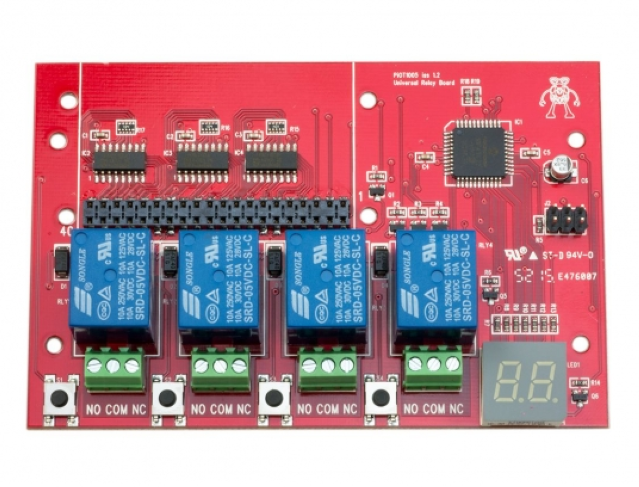
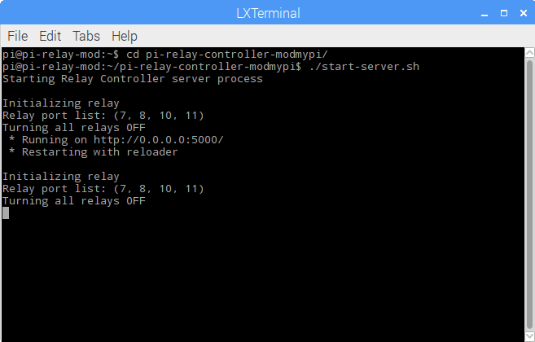
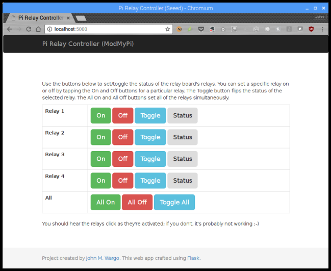

# Raspberry Pi Relay Controller for the ModMyPi Relay board

The [ModMyPi PiOT Relay Board](https://www.modmypi.com/raspberry-pi/breakout-boards/modmypi/modmypi-piot-relay-board) is a 4-port relay controller board for the Raspberry Pi. The ModMyPi folks provide a Python application you can use to interact the board, but as I learned how to program the board, I modified my [Raspberry Pi Relay Controller for the Seeed Studio Raspberry Pi Relay Board](https://github.com/johnwargo/Raspberry-Pi-Relay-Controller-Seeed) project so it worked with this board.

This project provides a library you can use in your Python applications plus a Python web application (written using [Flask](http://flask.pocoo.org/)) to interact with the board from a web browser.

This project is slightly different than the Seeed version. With the Seeed Relay controller, you could query the device to determine the status of any of the relay ports. For the ModMyPi PiOT board, the app has to track status of each port manually.

## About the Board

The board looks something like the following (image 'borrowed' from [pimoroni.com](https://www.modmypi.com/raspberry-pi/breakout-boards/modmypi/modmypi-piot-relay-board):

It provides 4 relays and enables you to use the buttons on the board to change the port assignments and toggle the relays. You can even stack the boards on top of each other to use 8, 12, or more relays for your project. 
   
## Hardware Components

To use this project, you'll need at a minimum the following hardware components:

+ [Raspberry Pi 3](https://www.raspberrypi.org/products/raspberry-pi-3-model-b/)
+ [ModMyPi PiOT Relay Board](https://www.modmypi.com/raspberry-pi/breakout-boards/modmypi/modmypi-piot-relay-board)
+ 5V, 2.5A Micro USB power source (basically, a smartphone charger) - I use the [CanaKit 5V 2.5A Raspberry Pi 3 Power Supply/Adapter/Charger](https://www.amazon.com/gp/product/B00MARDJZ4)
 
## Assembly

To assemble the hardware, mount the relay board on the Raspberry Pi using the instructions provided on the [board's wiki](https://github.com/modmypi/PiOT-Relay-Board/wiki). The board's too big to mount in any of the standard Raspberry Pi cases, so you'll have to find another way of securing the boards (Raspberry Pi and PiOT boards) in your project. 

Be sure to use the included standoffs to secure the PiOT board to your Raspberry Pi; the board wobbles precariously without them. For some reason, the folks at ModMy Pi didn't design the board so it used 4 standoffs; with the board mounted properly on a Raspberry Pi 2 or 3, there's only an option to use two standoffs (one on either side of the board's GPIO port).

## Configuring Your Raspberry Pi

Download the latest version of the Raspbian OS from the [Raspberry Pi web site](https://www.raspberrypi.org/downloads/raspbian/) and follow the [instructions](https://www.raspberrypi.org/documentation/installation/installing-images/README.md) for writing the OS image to a Micro SD card for the Pi. Insert the **SD card** in the Pi, connect **Ethernet**, **keyboard**, **mouse**, and a **monitor** to the Pi and finally **power it up** using a smartphone charger or some suitable power source.

Raspbian comes configured with its keyboard, timezone, and other locale settings configured for the United Kingdom (UK), so if you're in the US, or elsewhere that's not the UK, you'll want to switch over to the **localisation** tab and adjust the settings there as well.

When the Pi comes back up, open a terminal window and execute the following command:

	sudo apt-get update

This updates the local catalog of applications. Next, execute the following command:

	sudo apt-get upgrade

This command will update the Raspbian OS with all updates released after the latest image was published. The update process will take a long time, so pay attention, answer any prompts, and expect this process to take a few minutes or more (the last time I did this, it took about 15 minutes or more to complete).

## Software Installation & Configuration

The controller's Flask application uses Flask and the Flask Bootstrap plugin to serve [Bootstrap](http://getbootstrap.com/) applications, so in the terminal window, install the plugin by executing the following command:  

	sudo pip install flask flask_bootstrap

Finally, clone the controller application to your local system by executing the following commands:
 
	git clone https://github.com/johnwargo/pi-relay-controller-modmypi
	cd pi-relay-controller-modmypi

Since the relay's GPIO port assignments can be easily changed using the buttons on the board, before you can run the project, you must make one change to the project's server code. Open the project's `server.py` file using your editor of choice. Near the top of the file, you should see the following lines of code:

	# Update the following list/tuple with the port numbers assigned to your relay board
	PORTS = (7, 8, 10, 11)

This ports list refers to the GPIO port configuration for the board. Change the values here based on your board's configuration. I don't know what the default configuration is, the ModMyPi documentation doesn't say, but I know for my board, the relay ports are assigned to GPIO pins 7, 8, 10, and 11, so that's why my `PORTS` variable is configured like it is. Refer to the ModMyPi PiOT board documentation for details on how to determine and set the GPIO pin assignments.

## Starting the Server Process

Open a terminal window and execute the following commands:

	cd pi-relay-controller-modmypi
	ls

You should see the project's files listed. The project includes a script file to automate launching the server process. To use this file, you'll first have to make the file executable. In the terminal window, execute the following command:

	chmod +x start-server.sh

Once that's done, execute the script file using the following command:

	./start-server.sh

The server process will launch and update the terminal window as shown in the following figure:

If you open the web browser on the Pi and point it to `http://localhost:5000` you should see the web application load as shown in the following figure:

Click any of the buttons to interact with the PiOT board.

To make the server process start every time your boot the Raspberry Pi, you'll need to open the pi user's session autostart file using the following command:  

	sudo nano ~/.config/lxsession/LXDE-pi/autostart    

Add the following lines to the end (bottom) of the file:

	@lxterminal -e /home/pi/pi-relay-controller-modmypi/start-server.sh

To save your changes, press `ctrl-o` then press the Enter key. Next, press `ctrl-x` to exit the `nano` application.
  
Reboot the Raspberry Pi; when it restarts, the python server process should execute in its own terminal window automatically.

## Update History

Nothing yet.

***
By [John M. Wargo](http://www.johnwargo.com) - If you find this code useful, and feel like thanking me for providing it, please consider making a purchase from [my Amazon Wish List](https://amzn.com/w/1WI6AAUKPT5P9). You can find information on many different topics on my [personal blog](http://www.johnwargo.com). Learn about all of my publications at [John Wargo Books](http://www.johnwargobooks.com). 